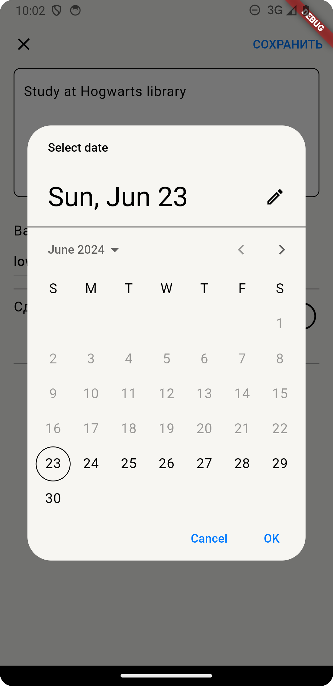
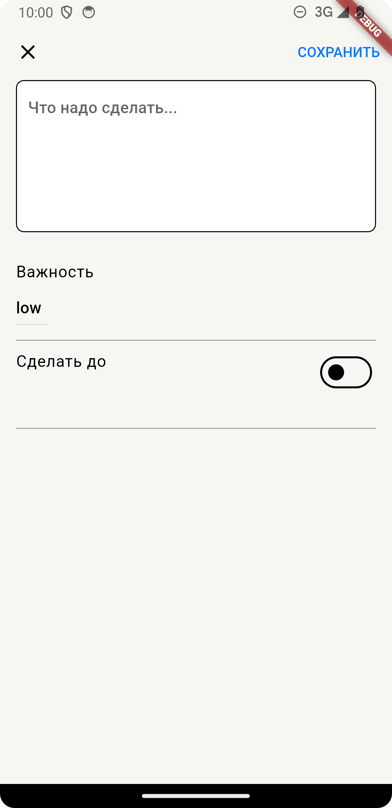
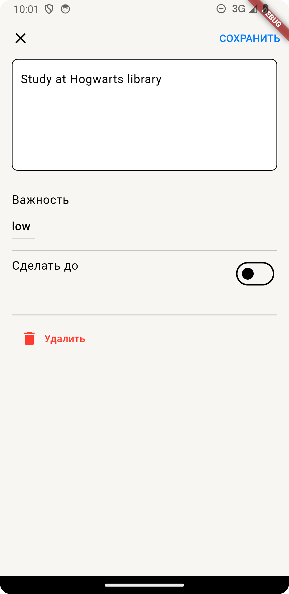
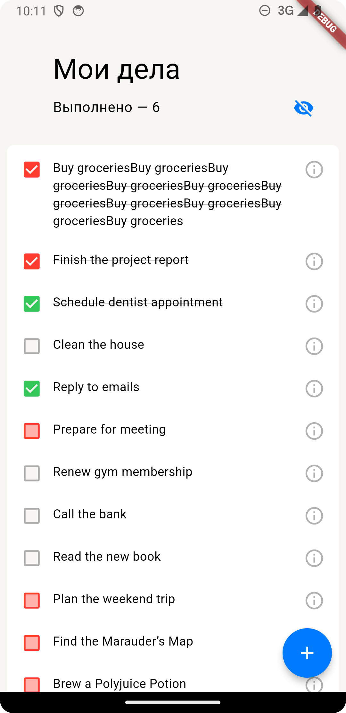

# flutter_todo_app

Тудушка

## Changes maded

- Сверстаны два экрана основной и добавления/редактирования задачи
- Реализован свайп по айтему
- Показ выполненных дел
- Добавлено логгирование в дата слой и немного в блок
- На андроиде есть иконка
- При создании новой записи кнопка удалить скрыта

**New:**

- Добавлена локализация
- Локальное сохранение через HydratedBloc
- Походы в сеть через dio
- Немного поправлен стейт менеджер

